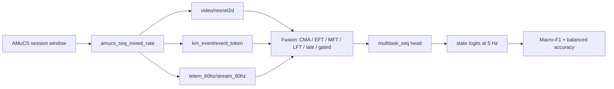

# Multimodal Gameplay-Native Arousal State Recognition on AMuCS

Gameplay-native affect recognition for AMuCS: video, keyboard/mouse behavior,
and game telemetry fused into a 5 Hz arousal timeline.

[Chinese README](README_zh.md)


## What This Is

This repository has two layers:

1. A complete experiment stack for AMuCS gameplay arousal recognition.
2. A small registry-based multimodal framework where encoders, fusions, heads,
   losses, metrics, and datamodules are selected from YAML.

The current flagship experiment is `Path C`: state-only, mixed-rate,
three-class arousal classification using CLIP video features, raw
keyboard/mouse events, and 60 Hz game telemetry.

Older regression, state+trend multitask, trajectory, and pilot experiments are
kept for auditability. They are not the main setup described here.

## Current Task

Predict the player's arousal state at each 5 Hz video time step.

| Item | Current setting |
|---|---|
| Dataset | AMuCS affective Counter-Strike gameplay sessions |
| Target | `state` |
| Classes | `0 = low`, `1 = mid`, `2 = high` |
| Label source | RankTrace arousal aligned to the video timeline |
| Label normalization | Per-session z-score |
| Class thresholds | Training-set tertiles |
| Tertiles | `q33 = -0.5012`, `q67 = 0.3654` |
| Timeline | 5 Hz video/label grid |
| Window | 600 video frames = 120 seconds |
| Stride | 300 video frames = 60 seconds |
| Main metric | Macro-F1 |

For the three-modality setting, the common usable subset is 87 labelled game
sessions from 51 participants. The label file contains 90 sessions from 54
participants; three are excluded when `telem_60hz` is required.

## Signals

The main mixed-rate setup keeps each signal at its natural rate until the
datamodule builds a training window.

| Modality | Data directory | Raw input to model | Encoder | Output grid |
|---|---|---|---|---|
| `video` | `video_clip` | CLIP ViT-L/14 frame embeddings, `[T, 768]` at 5 Hz | `video/resnet2d` | `[T, 512]` |
| `km_event` | `km_event` | Keyboard/mouse event tokens, `[T_k, 4]` | `km_event/event_token` | `[T, 512]` after 5 Hz bin pooling |
| `telem_60hz` | `telem_60hz` | 23 telemetry variables, `[12T, 23]` at 60 Hz | `telem_60hz/stream_60hz` | `[T, 512]` after stride-12 temporal encoding |

`video/resnet2d` is a legacy registry name. In the current experiment it
consumes pre-extracted CLIP features; it does not run a ResNet during training.

Legacy window-level modalities are still supported by the framework:
`km/stat` for 25-dimensional keyboard/mouse statistics and `telem/stat_pool`
for telemetry statistics.

## Pipeline



The stable contract is:

```text
Batch
  x:        {modality: Tensor}
  mod_mask: {modality: BoolTensor}
  y:        {task: Tensor}
  mask:     {task: BoolTensor}

EncoderOut
  tokens: [B, T, D]
  pooled: [B, D]
  mask:   [B, T]

FusionOut
  tokens: [B, T, D] or None
  pooled: [B, D]
```

## Main Sweep

The flagship sweep is:

```text
configs/sweeps/pathC_full_state_only.yaml
```

It expands to:

```text
9 model variants x 4 modality combinations x 2 split modes x 3 seeds = 216 runs
```

### Name Decoder

The run names keep short historical labels, but the actual model changes are:

| Label | Full meaning | What it does in this codebase |
|---|---|---|
| `EFT` | Early Fusion Transformer | Encodes each active modality, concatenates all modality token sequences, then runs one shared Transformer. Cross-modal interaction starts in the first self-attention layer. |
| `MFT` | Mid Fusion Transformer | Runs modality-private Transformer layers first, then cross-modal attention layers. |
| `LFT` | Late Fusion Transformer | Processes each modality independently, pools each modality, then fuses modality-level representations near the output. |
| `CMA` | Cross-Modal Attention | Uses directional cross-attention; when video is present, video is the default anchor/key-value source. |
| `C` | Contrastive alignment direction | Adds a cross-modal InfoNCE auxiliary loss before fusion. Same-sample modality pairs are positives; other samples are negatives. The implementation pools encoder tokens, projects them to `proj_dim = 128`, and weights the loss by `lambda_align = 0.1`. |
| `D` | Multi-scale temporal direction | Adds a residual multi-scale 1D temporal convolution block after each encoder and before fusion. The default dilations are `[1, 5, 25]`, capturing short, medium, and longer gameplay patterns on the 5 Hz timeline. |
| `CD` | Combined C + D | Enables both contrastive alignment and multi-scale temporal encoding on top of EFT. |

Model variants:

| Task key | Full reading |
|---|---|
| `cma_state_only` | Cross-Modal Attention for state-only classification. |
| `eft_state_only` | Early Fusion Transformer for state-only classification. |
| `mft_state_only` | Mid Fusion Transformer for state-only classification. |
| `lft_state_only` | Late Fusion Transformer for state-only classification. |
| `late_state_only` | Late fusion baseline for state-only classification. |
| `gated_state_only` | Gated fusion baseline with learned modality gates. |
| `eft_C_state_only` | Early Fusion Transformer plus contrastive alignment auxiliary loss. |
| `eft_D_state_only` | Early Fusion Transformer plus multi-scale temporal encoding. |
| `eft_CD_state_only` | Early Fusion Transformer plus both contrastive alignment and multi-scale temporal encoding. |

Modality combinations:

```text
[video, km_event, telem_60hz]
[video, km_event]
[video, telem_60hz]
[km_event, telem_60hz]
```

Split modes:

| Split | Meaning |
|---|---|
| `cross_subject` | Train/val/test participants are disjoint via `session_tvt.json` |
| `within_subject` | Same sessions, temporal split: 60% / 20% / 20% |

Shared training settings in the sweep: AdamW, learning rate `5e-5`, weight
decay `0.01`, cosine scheduler, 3 warmup epochs, batch size 32 before
multi-modality downscaling, max 40 epochs, dropout 0.1, label smoothing 0.1,
early stopping on `val_macro_f1_state`.

## Components

Everything self-registers and is selected by string key in YAML.

| Type | Registered options used in this repo |
|---|---|
| Datamodules | `amucs`, `amucs_seq`, `amucs_seq_multitask`, `amucs_seq_mixed_rate`, `amucs_trajectory`, `video_window`, `km_window` |
| Video encoders | `video/resnet2d`, `video/emotieff` |
| KM encoders | `km/stat`, `km/cnn1d`, `km_event/event_token` |
| Telemetry encoders | `telem/stat_pool`, `telem_60hz/stream_60hz` |
| Fusions | `single`, `aligned_mean`, `eft`, `mft`, `lft`, `cma`, `gated`, `late` |
| Heads | `regression`, `regression_seq`, `va_split`, `classification_seq`, `multitask_seq`, `multitask_mixed_seq`, `task_aware_multitask_seq` |
| Losses | `ccc`, `mse`, `smooth_l1`, `mse_seq_masked`, `ce_seq_masked`, `multitask_ce_seq_masked`, `multitask_mixed_seq_loss` |
| Metrics | `ccc`, `rmse`, `mse`, `macro_f1`, `balanced_acc` |

## Repository Map

```text
ProjectExperiment/
  configs/
    base.yaml
    sweeps/pathC_full_state_only.yaml
  encoder/
    common/extract_km_event.py
    common/extract_telem_60hz.py
  scripts/
    train.py
    run_experiment.py
    summarize.py
    extract_video_features.py
  src/
    core/                 # frozen interfaces, registry, runner, config
    data/datamodules/     # AMuCS datamodules
    models/encoders/      # modality encoders
    models/fusions/       # fusion architectures
    models/heads/         # prediction heads
    losses/
    metrics/
  tests/
  docs/
  runs/                   # ignored except runs/.gitkeep
```

## Data Layout

Raw AMuCS data and derived `.pt` feature tensors are not committed. A local
experiment directory should look like this:

```text
AmuCS_experiment/
  features/
    aligned/
      video_clip/
        S001_P3.pt
      km_event/
        S001_P3.pt
      telem_60hz/
        S001_P3.pt
  labels/
    arousal_state_trend_seq.json
  splits/
    session_tvt.json
    within_subject.json
  runs/
```

Each `.pt` file is named by session stem.

## Quick Start

Use this path for a smoke run before launching the full 216-run sweep. The
commands assume the `.pt` features and labels already exist in the layout above.

### 1. Install the core runtime

This repo does not ship a lockfile. Install the minimal training dependencies
first; add feature-extraction dependencies only when you need those scripts.

```bash
python -m venv .venv

# Windows PowerShell
. ./.venv/Scripts/Activate.ps1

# macOS/Linux/Colab
source .venv/bin/activate

pip install torch pyyaml scikit-learn pytest
```

For GPU training, install the PyTorch build that matches your CUDA runtime.

### 2. Set the four paths

Use the same four roots in every command:

| Argument | Points to | Must contain |
|---|---|---|
| `--data_root` | aligned feature root | `video_clip/`, `km_event/`, `telem_60hz/` |
| `--labels_root` | label directory | `arousal_state_trend_seq.json` |
| `--splits_root` | split directory | `session_tvt.json`, `within_subject.json` |
| `--runs_root` | output directory | created automatically if missing |

Example root values:

```text
--data_root   "G:/path/to/AmuCS_experiment/features/aligned"
--labels_root "G:/path/to/AmuCS_experiment/labels"
--splits_root "G:/path/to/AmuCS_experiment/splits"
--runs_root   "G:/path/to/AmuCS_experiment/runs/quickstart"
```

### 3. Check the full sweep plan

This validates that the sweep file and CLI roots are wired correctly without
starting training.

```bash
python scripts/run_experiment.py \
  --sweep configs/sweeps/pathC_full_state_only.yaml \
  --dry_run \
  --data_root "G:/path/to/AmuCS_experiment/features/aligned" \
  --labels_root "G:/path/to/AmuCS_experiment/labels" \
  --splits_root "G:/path/to/AmuCS_experiment/splits"
```

### 4. Create a one-run smoke sweep

The committed `pathC_full_state_only.yaml` is intentionally large. For a quick
training example, generate a temporary sweep with one seed, one split, one
modality pair, and one task.

```bash
python -c "from pathlib import Path; import yaml; s=yaml.safe_load(Path('configs/sweeps/pathC_full_state_only.yaml').read_text(encoding='utf-8')); s['seeds']=[0]; s['modalities']=[['video','km_event']]; s['split_modes']={'cross_subject': s['split_modes']['cross_subject']}; s['tasks']={'cma_state_only': s['tasks']['cma_state_only']}; Path('configs/sweeps/quickstart.yaml').write_text(yaml.safe_dump(s, sort_keys=False, allow_unicode=True), encoding='utf-8')"
```

The important configuration knobs are:

| YAML key | What to change |
|---|---|
| `seeds` | Repeat count. Use `[0]` for a smoke run. |
| `modalities` | Active signals. Start with `[video, km_event]` or `[video, telem_60hz]`. |
| `split_modes` | Evaluation protocol. Start with only `cross_subject`. |
| `tasks` | Model variants. Start with one task such as `cma_state_only`. |
| `shared.data.seq_len_video_frames` | Window length in 5 Hz frames. Default `600` means 120 seconds. |
| `shared.data.train_stride_video_frames` | Training stride in 5 Hz frames. Default `300` means 60 seconds. |

### 5. Run the smoke training example

```bash
python -u scripts/run_experiment.py \
  --sweep configs/sweeps/quickstart.yaml \
  --workers 1 \
  --data_root "G:/path/to/AmuCS_experiment/features/aligned" \
  --labels_root "G:/path/to/AmuCS_experiment/labels" \
  --splits_root "G:/path/to/AmuCS_experiment/splits" \
  --runs_root "G:/path/to/AmuCS_experiment/runs/quickstart"
```

A successful run writes a timestamped run directory plus `results.tsv` and
`results_summary.csv` under the selected `--runs_root`.

### 6. Run the contract tests

```bash
python -m pytest tests/
```

## Full Sweep Commands

This repo currently has no dependency lockfile. For the core training path,
use a Python environment with PyTorch, PyYAML, and pytest installed. Feature
extraction and baseline scripts may need extra packages for their specific
workflow.

Run the main sweep:

```bash
python -u scripts/run_experiment.py \
  --sweep configs/sweeps/pathC_full_state_only.yaml \
  --workers 1 \
  --data_root "G:/path/to/AmuCS_experiment/features/aligned" \
  --labels_root "G:/path/to/AmuCS_experiment/labels" \
  --splits_root "G:/path/to/AmuCS_experiment/splits" \
  --runs_root "G:/path/to/AmuCS_experiment/runs/pathC_full_state_only"
```

Print the plan without training:

```bash
python scripts/run_experiment.py \
  --sweep configs/sweeps/pathC_full_state_only.yaml \
  --dry_run \
  --data_root "G:/path/to/AmuCS_experiment/features/aligned" \
  --labels_root "G:/path/to/AmuCS_experiment/labels" \
  --splits_root "G:/path/to/AmuCS_experiment/splits"
```

Run one task:

```bash
python -u scripts/run_experiment.py \
  --sweep configs/sweeps/pathC_full_state_only.yaml \
  --tasks cma_state_only \
  --workers 1 \
  --data_root "G:/path/to/AmuCS_experiment/features/aligned" \
  --labels_root "G:/path/to/AmuCS_experiment/labels" \
  --splits_root "G:/path/to/AmuCS_experiment/splits" \
  --runs_root "G:/path/to/AmuCS_experiment/runs/pathC_full_state_only"
```

Run a single YAML config:

```bash
python scripts/train.py --config configs/base.yaml
```

Apply CLI overrides:

```bash
python scripts/train.py \
  --config configs/base.yaml \
  --override model.fusion.name=single train.seed=0
```

Run shape-contract tests:

```bash
python -m pytest tests/
```

## Outputs

Single training runs create timestamped directories under `runs_dir`:

```text
{timestamp}__{dataset}__{fusion}__{modalities}__seed{seed}/
  config.yaml
  seed.txt
  git_commit.txt
  ckpt_best.pt
  ckpt_last.pt
  metrics.json
```

Sweep tasks additionally write:

```text
results.tsv
results_summary.csv
```

## Local Result Anchors

These are local experiment summaries, not public benchmark claims.

| Model group | Split | Input | Test macro-F1 | Test balanced accuracy | Source |
|---|---|---|---:|---:|---|
| XGBoost baseline | participant-independent | statistical video + KM + telemetry features | 0.4416 | 0.4491 | `runs/dumb_baseline/results.csv` |
| CMA Transformer | participant-independent | `video + km_event` | `0.4299 +/- 0.0065` | `0.4343 +/- 0.0121` | `cma_state_only_3seed/results_summary.csv` |

The dissertation discussion uses these numbers to explain why a simple
statistical baseline can remain competitive with heavier Transformer fusion.

## Extend It

Add a new encoder:

1. Create `src/models/encoders/{modality}/{name}.py`.
2. Implement `BaseEncoder`.
3. Register it with `get_encoder_registry("{modality}").register("{name}")`.
4. Select it in YAML under `model.encoders.{modality}.name`.

Add a new fusion:

1. Create `src/models/fusions/{name}.py`.
2. Implement `BaseFusion`.
3. Register it with `@FUSIONS.register("{name}")`.
4. Select it in YAML under `model.fusion.name`.

No core runner changes are needed for normal extensions.

## Git Hygiene

Keep code, configs, lightweight notebooks, docs, and small result summaries.
Do not commit raw AMuCS data, derived `.pt` tensors, checkpoints, or full run
directories. The `.gitignore` already excludes:

```text
data/
features/
runs/*
checkpoints/
*.pt
*.pth
.pytest_cache/
```

If a result must be tracked, commit a small CSV or figure under `docs/`, not a
full `runs/` tree.
