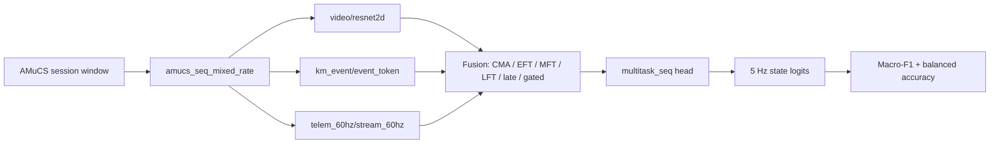

# 基于 AMuCS 的游戏原生多模态唤醒度状态识别

面向 AMuCS 的 gameplay-native 情感识别项目：把游戏视频、键盘鼠标行为和游戏遥测，融合成一条 5 Hz 的唤醒度时间线。

[English README](README.md)


## 这个项目是什么

这个仓库有两层：

1. 一套面向 AMuCS 游戏场景唤醒度识别的完整实验代码。
2. 一个轻量的注册表式多模态框架：encoder、fusion、head、loss、metric、datamodule 都由 YAML 字符串选择。

当前主线实验是 `Path C`：state-only、mixed-rate、三分类 arousal state recognition。输入是 CLIP 视频帧特征、原始键盘鼠标事件和 60 Hz 游戏遥测。

仓库里也保留了旧的回归、state+trend multitask、trajectory pilot 等探索性实验，用来追踪实验历史；它们不是本 README 描述的主设置。

## 当前任务

在 5 Hz 视频时间线上，逐时间步预测玩家的 arousal state。

| 项目 | 当前设置 |
|---|---|
| 数据集 | AMuCS Counter-Strike gameplay affect sessions |
| 预测目标 | `state` |
| 类别 | `0 = low`, `1 = mid`, `2 = high` |
| 标签来源 | RankTrace arousal，对齐到视频时间线 |
| 标签归一化 | 每个 session 内 z-score |
| 类别阈值 | 训练集 normalized arousal 三分位数 |
| 三分位数 | `q33 = -0.5012`, `q67 = 0.3654` |
| 时间线 | 5 Hz video/label grid |
| 窗口长度 | 600 个视频帧 = 120 秒 |
| 窗口步长 | 300 个视频帧 = 60 秒 |
| 主指标 | Macro-F1 |

在三模态设置下，可共同使用的样本是 87 个 labelled game sessions，来自 51 名 participants。完整标签文件包含 90 个 sessions、54 名 participants；其中 3 个 session 因缺少 `telem_60hz` 而不进入三模态实验。

## 输入信号

主线 mixed-rate 设置会保留每个信号自己的原始采样率，直到 datamodule 构建训练窗口。

| 模态 | 数据目录 | 模型输入 | Encoder | 输出时间线 |
|---|---|---|---|---|
| `video` | `video_clip` | CLIP ViT-L/14 frame embeddings，5 Hz 下 `[T, 768]` | `video/resnet2d` | `[T, 512]` |
| `km_event` | `km_event` | 键盘鼠标事件 token，`[T_k, 4]` | `km_event/event_token` | 按 5 Hz bin 聚合成 `[T, 512]` |
| `telem_60hz` | `telem_60hz` | 23 个 60 Hz 遥测变量，`[12T, 23]` | `telem_60hz/stream_60hz` | stride-12 temporal encoding 后 `[T, 512]` |

`video/resnet2d` 是历史遗留注册名。当前实验中它消费的是预提取 CLIP 特征，训练时不会运行 ResNet。

框架仍然支持旧的窗口级统计模态：`km/stat` 对应 25 维键盘鼠标统计特征，`telem/stat_pool` 对应遥测统计特征。

## 模型流水线



核心数据契约如下：

```text
Batch
  x:        {modality: Tensor}
  mod_mask: {modality: BoolTensor}
  y:        {task: Tensor}
  mask:     {task: BoolTensor}

EncoderOut
  tokens: [B, T, D]
  pooled: [B, D]
  mask:   [B, T]

FusionOut
  tokens: [B, T, D] or None
  pooled: [B, D]
```

## 主线 Sweep

主线 sweep 文件是：

```text
configs/sweeps/pathC_full_state_only.yaml
```

它展开后是：

```text
9 个模型变体 x 4 个模态组合 x 2 种 split x 3 个 seed = 216 runs
```

### 名称解码

run 名里保留了一些历史缩写，但 README 里按实际含义解释如下：

| 缩写 | 全称 | 在当前代码里的含义 |
|---|---|---|
| `EFT` | Early Fusion Transformer | 各模态先分别编码，再把所有模态 token 序列拼接起来，送入一个共享 Transformer。从第一层 self-attention 开始就发生跨模态交互。 |
| `MFT` | Mid Fusion Transformer | 先做各模态私有 Transformer 层，再做跨模态 attention 层。 |
| `LFT` | Late Fusion Transformer | 各模态独立处理并池化，最后在模态级表示上融合。 |
| `CMA` | Cross-Modal Attention | 方向性跨模态 attention；有 video 时默认以 video 作为 anchor / key-value 来源。 |
| `C` | Contrastive alignment direction | fusion 前加入跨模态 InfoNCE 辅助损失。同一个样本的不同模态是正样本对，batch 内其他样本是负样本。实现中会先池化 encoder token，投影到 `proj_dim = 128`，并用 `lambda_align = 0.1` 加权。 |
| `D` | Multi-scale temporal direction | 在每个 encoder 之后、fusion 之前加入残差式多尺度 1D 时序卷积。默认 dilation 是 `[1, 5, 25]`，用于覆盖 5 Hz 时间线上的短、中、长 gameplay pattern。 |
| `CD` | C + D combined | 在 EFT 上同时启用 contrastive alignment 和 multi-scale temporal encoding。 |

模型变体：

| task key | 完整含义 |
|---|---|
| `cma_state_only` | 使用 Cross-Modal Attention 的 state-only 分类模型。 |
| `eft_state_only` | 使用 Early Fusion Transformer 的 state-only 分类模型。 |
| `mft_state_only` | 使用 Mid Fusion Transformer 的 state-only 分类模型。 |
| `lft_state_only` | 使用 Late Fusion Transformer 的 state-only 分类模型。 |
| `late_state_only` | late fusion baseline，用于 state-only 分类。 |
| `gated_state_only` | 学习模态 gate 的 gated fusion baseline。 |
| `eft_C_state_only` | Early Fusion Transformer + contrastive alignment 辅助损失。 |
| `eft_D_state_only` | Early Fusion Transformer + multi-scale temporal encoding。 |
| `eft_CD_state_only` | Early Fusion Transformer 同时加入 contrastive alignment 和 multi-scale temporal encoding。 |

四种模态组合：

```text
[video, km_event, telem_60hz]
[video, km_event]
[video, telem_60hz]
[km_event, telem_60hz]
```

两种 split：

| Split | 含义 |
|---|---|
| `cross_subject` | 通过 `session_tvt.json` 做 participant-independent evaluation，train/val/test participant 不重叠 |
| `within_subject` | 同一批 session 内做时间泛化，60% / 20% / 20% |

主 sweep 的共享训练设置：AdamW，learning rate `5e-5`，weight decay `0.01`，cosine scheduler，3 个 warmup epochs，batch size 32 后按模态数下调，最多 40 epochs，dropout 0.1，label smoothing 0.1，并用 `val_macro_f1_state` early stopping。

## 组件注册表

所有组件都通过注册表自注册，并由 YAML 字符串选择。

| 类型 | 当前仓库中的注册项 |
|---|---|
| Datamodule | `amucs`, `amucs_seq`, `amucs_seq_multitask`, `amucs_seq_mixed_rate`, `amucs_trajectory`, `video_window`, `km_window` |
| Video encoder | `video/resnet2d`, `video/emotieff` |
| KM encoder | `km/stat`, `km/cnn1d`, `km_event/event_token` |
| Telemetry encoder | `telem/stat_pool`, `telem_60hz/stream_60hz` |
| Fusion | `single`, `aligned_mean`, `eft`, `mft`, `lft`, `cma`, `gated`, `late` |
| Head | `regression`, `regression_seq`, `va_split`, `classification_seq`, `multitask_seq`, `multitask_mixed_seq`, `task_aware_multitask_seq` |
| Loss | `ccc`, `mse`, `smooth_l1`, `mse_seq_masked`, `ce_seq_masked`, `multitask_ce_seq_masked`, `multitask_mixed_seq_loss` |
| Metric | `ccc`, `rmse`, `mse`, `macro_f1`, `balanced_acc` |

## 仓库结构

```text
ProjectExperiment/
  configs/
    base.yaml
    sweeps/pathC_full_state_only.yaml
  encoder/
    common/extract_km_event.py
    common/extract_telem_60hz.py
  scripts/
    train.py
    run_experiment.py
    summarize.py
    extract_video_features.py
  src/
    core/                 # 冻结接口、注册表、runner、配置系统
    data/datamodules/     # AMuCS datamodule
    models/encoders/      # 各模态 encoder
    models/fusions/       # 融合结构
    models/heads/         # 预测头
    losses/
    metrics/
  tests/
  docs/
  runs/                   # 除 runs/.gitkeep 外被忽略
```

## 数据目录

原始 AMuCS 数据和派生 `.pt` 特征不会提交到仓库。本地实验目录建议保持如下结构：

```text
AmuCS_experiment/
  features/
    aligned/
      video_clip/
        S001_P3.pt
      km_event/
        S001_P3.pt
      telem_60hz/
        S001_P3.pt
  labels/
    arousal_state_trend_seq.json
  splits/
    session_tvt.json
    within_subject.json
  runs/
```

每个 `.pt` 文件使用 session stem 命名。

## 快速开始

这条路径用于在启动完整 216-run sweep 之前先做一次 smoke run。下面命令假设你已经按上面的目录结构准备好了 `.pt` 特征、标签和 split 文件。

### 1. 安装核心运行环境

仓库目前没有 dependency lockfile。先装最小训练依赖；只有在需要特征提取脚本时，再补对应额外依赖。

```bash
python -m venv .venv

# Windows PowerShell
. ./.venv/Scripts/Activate.ps1

# macOS/Linux/Colab
source .venv/bin/activate

pip install torch pyyaml scikit-learn pytest
```

如果要用 GPU，PyTorch 需要安装与你的 CUDA runtime 匹配的版本。

### 2. 配置四个路径

所有训练命令都围绕这四个路径：

| 参数 | 指向哪里 | 必须包含 |
|---|---|---|
| `--data_root` | aligned feature 根目录 | `video_clip/`, `km_event/`, `telem_60hz/` |
| `--labels_root` | 标签目录 | `arousal_state_trend_seq.json` |
| `--splits_root` | 数据划分目录 | `session_tvt.json`, `within_subject.json` |
| `--runs_root` | 输出目录 | 不存在时会自动创建 |

示例路径：

```text
--data_root   "G:/path/to/AmuCS_experiment/features/aligned"
--labels_root "G:/path/to/AmuCS_experiment/labels"
--splits_root "G:/path/to/AmuCS_experiment/splits"
--runs_root   "G:/path/to/AmuCS_experiment/runs/quickstart"
```

### 3. 先检查完整 sweep 计划

这一步只验证 sweep 文件和命令行路径是否能正确接上，不会开始训练。

```bash
python scripts/run_experiment.py \
  --sweep configs/sweeps/pathC_full_state_only.yaml \
  --dry_run \
  --data_root "G:/path/to/AmuCS_experiment/features/aligned" \
  --labels_root "G:/path/to/AmuCS_experiment/labels" \
  --splits_root "G:/path/to/AmuCS_experiment/splits"
```

### 4. 生成一个单 run 的 smoke sweep

仓库提交的 `pathC_full_state_only.yaml` 是完整实验矩阵，规模较大。快速示例可以临时生成一个只包含 1 个 seed、1 种 split、1 个模态组合、1 个 task 的 sweep。

```bash
python -c "from pathlib import Path; import yaml; s=yaml.safe_load(Path('configs/sweeps/pathC_full_state_only.yaml').read_text(encoding='utf-8')); s['seeds']=[0]; s['modalities']=[['video','km_event']]; s['split_modes']={'cross_subject': s['split_modes']['cross_subject']}; s['tasks']={'cma_state_only': s['tasks']['cma_state_only']}; Path('configs/sweeps/quickstart.yaml').write_text(yaml.safe_dump(s, sort_keys=False, allow_unicode=True), encoding='utf-8')"
```

最常改的配置项是：

| YAML key | 作用 |
|---|---|
| `seeds` | 重复次数。smoke run 用 `[0]`。 |
| `modalities` | 启用哪些信号。建议先用 `[video, km_event]` 或 `[video, telem_60hz]`。 |
| `split_modes` | 评估协议。快速示例先只保留 `cross_subject`。 |
| `tasks` | 模型变体。快速示例先保留一个，例如 `cma_state_only`。 |
| `shared.data.seq_len_video_frames` | 5 Hz 帧数形式的窗口长度。默认 `600` 是 120 秒。 |
| `shared.data.train_stride_video_frames` | 5 Hz 帧数形式的训练步长。默认 `300` 是 60 秒。 |

### 5. 运行简单训练示例

```bash
python -u scripts/run_experiment.py \
  --sweep configs/sweeps/quickstart.yaml \
  --workers 1 \
  --data_root "G:/path/to/AmuCS_experiment/features/aligned" \
  --labels_root "G:/path/to/AmuCS_experiment/labels" \
  --splits_root "G:/path/to/AmuCS_experiment/splits" \
  --runs_root "G:/path/to/AmuCS_experiment/runs/quickstart"
```

成功后会在 `--runs_root` 下写入一个带时间戳的 run 目录，并在任务目录中生成 `results.tsv` 和 `results_summary.csv`。

### 6. 运行契约测试

```bash
python -m pytest tests/
```

## 完整运行命令

这个仓库目前没有 dependency lockfile。核心训练路径需要一个安装了 PyTorch、PyYAML 和 pytest 的 Python 环境；特征提取和 baseline 脚本可能需要各自额外依赖。

运行主线 sweep：

```bash
python -u scripts/run_experiment.py \
  --sweep configs/sweeps/pathC_full_state_only.yaml \
  --workers 1 \
  --data_root "G:/path/to/AmuCS_experiment/features/aligned" \
  --labels_root "G:/path/to/AmuCS_experiment/labels" \
  --splits_root "G:/path/to/AmuCS_experiment/splits" \
  --runs_root "G:/path/to/AmuCS_experiment/runs/pathC_full_state_only"
```

只打印计划，不开始训练：

```bash
python scripts/run_experiment.py \
  --sweep configs/sweeps/pathC_full_state_only.yaml \
  --dry_run \
  --data_root "G:/path/to/AmuCS_experiment/features/aligned" \
  --labels_root "G:/path/to/AmuCS_experiment/labels" \
  --splits_root "G:/path/to/AmuCS_experiment/splits"
```

只运行一个任务，例如 CMA：

```bash
python -u scripts/run_experiment.py \
  --sweep configs/sweeps/pathC_full_state_only.yaml \
  --tasks cma_state_only \
  --workers 1 \
  --data_root "G:/path/to/AmuCS_experiment/features/aligned" \
  --labels_root "G:/path/to/AmuCS_experiment/labels" \
  --splits_root "G:/path/to/AmuCS_experiment/splits" \
  --runs_root "G:/path/to/AmuCS_experiment/runs/pathC_full_state_only"
```

运行单个 YAML 配置：

```bash
python scripts/train.py --config configs/base.yaml
```

使用 CLI override：

```bash
python scripts/train.py \
  --config configs/base.yaml \
  --override model.fusion.name=single train.seed=0
```

运行形状契约测试：

```bash
python -m pytest tests/
```

## 输出结构

单次训练会在 `runs_dir` 下创建时间戳目录：

```text
{timestamp}__{dataset}__{fusion}__{modalities}__seed{seed}/
  config.yaml
  seed.txt
  git_commit.txt
  ckpt_best.pt
  ckpt_last.pt
  metrics.json
```

Sweep 任务还会额外写出：

```text
results.tsv
results_summary.csv
```

## 本地结果锚点

这些是本地实验摘要，不是公开 benchmark claim。

| 模型组 | Split | 输入 | Test macro-F1 | Test balanced accuracy | 来源 |
|---|---|---|---:|---:|---|
| XGBoost baseline | participant-independent | statistical video + KM + telemetry features | 0.4416 | 0.4491 | `runs/dumb_baseline/results.csv` |
| CMA Transformer | participant-independent | `video + km_event` | `0.4299 +/- 0.0065` | `0.4343 +/- 0.0121` | `cma_state_only_3seed/results_summary.csv` |

论文讨论会用这些数字解释：为什么简单统计 baseline 仍然能接近甚至超过更重的 Transformer fusion。

## 如何扩展

新增 encoder：

1. 新建 `src/models/encoders/{modality}/{name}.py`。
2. 实现 `BaseEncoder`。
3. 用 `get_encoder_registry("{modality}").register("{name}")` 注册。
4. 在 YAML 中设置 `model.encoders.{modality}.name`。

新增 fusion：

1. 新建 `src/models/fusions/{name}.py`。
2. 实现 `BaseFusion`。
3. 用 `@FUSIONS.register("{name}")` 注册。
4. 在 YAML 中设置 `model.fusion.name`。

正常扩展不需要改 core runner。

## Git 上传原则

仓库应该保存代码、配置、轻量 notebook、文档和小型结果摘要。不要提交原始 AMuCS 数据、派生 `.pt` 特征、checkpoint 或完整 run 目录。`.gitignore` 已经排除：

```text
data/
features/
runs/*
checkpoints/
*.pt
*.pth
.pytest_cache/
```

如果某个结果必须进入版本库，提交小型 CSV 或图表到 `docs/`，不要提交完整 `runs/` 树。
